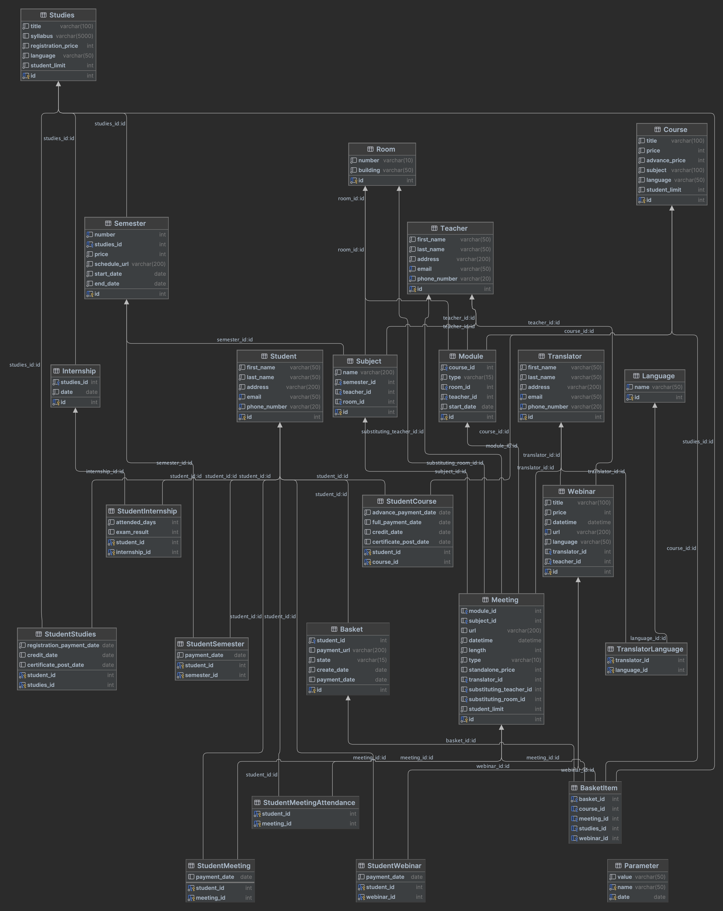

Fundamentals of Databases 2023/2024 – project

### The repository includes:

* The [diagram](https://github.com/halotukozak/PBD/blob/main/diagram.png) of the database (with PKs, FKs and relations)
* The [SQL schema](https://github.com/halotukozak/PBD/blob/main/schema.sql) which contains the CREATE TABLE statements
* The [SQL triggers](https://github.com/halotukozak/PBD/blob/main/triggers.sql) which contains the CREATE TRIGGER
  statements
* The [SQL views](https://github.com/halotukozak/PBD/blob/main/views.sql) which contains the CREATE VIEW statements
* The [SQL procedures](https://github.com/halotukozak/PBD/blob/main/procedures.sql) which contains the CREATE PROCEDURE
  statements
* The [SQL functions](https://github.com/halotukozak/PBD/blob/main/functions.sql) which contains the CREATE FUNCTION
  statements
* The [SQL roles](https://github.com/halotukozak/PBD/blob/main/functions.sql) which contains the CREATE ROLE and GRANT EXECUTE statements
* The [Faker](https://github.com/halotukozak/PBD/tree/main/Faker) which is a project made in Kotlin to generate random
  data.

The full documentation is available in [Wiki](https://github.com/halotukozak/PBD/wiki) tab  

by [Bartosz Buczek](https://github.com/Corvette653), [Bartłomiej Kozak](https://github.com/halotukozak), [Tomasz Kurcoń](https://github.com/tomaszkurcon)
